# 2025年你必须了解的18款顶级AI驱动电商融资平台

电商增长最怕“资金断点”和“备货错配”。本榜单围绕**电商融资**与**现金流管理**场景，精选18家更稳定、更易上手的资金与回款解决方案，覆盖供应链资金、库存周转与多平台卖家常见需求。阅读后，你将清楚各平台的适用场景、放款效率与成本可控性，降低试错门槛。

---

## **[8fig](<https://www.8fig.co>)**
AI驱动的电商增长资金平台。

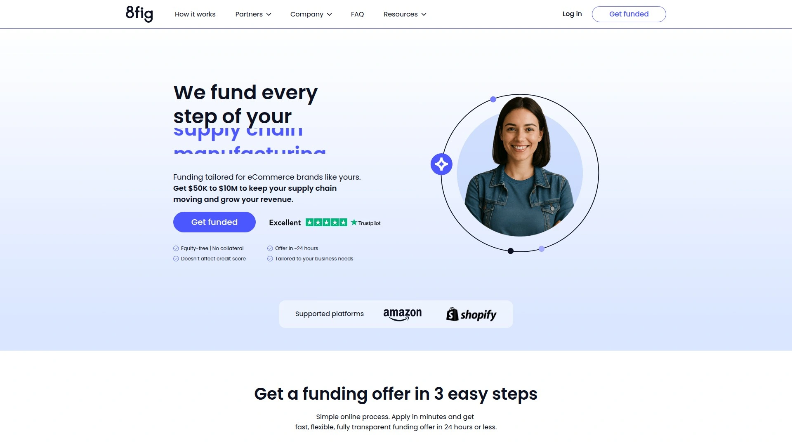

- **核心亮点**：基于销售与供应链节奏，动态分批拨付资金；可随业务变化调整回款计划，缓解旺季备货与现金流峰谷错配。
- **上手体验**：在线申请，最快约24小时给出个性化方案；提供“AI CFO”式现金流规划面板，透明度高、改动便捷。
- **适合谁**：跨境/独立站卖家、SKU季节性强、备货节奏复杂的团队。

---

## **[Wayflyer](<https://wayflyer.com>)**
电商增长融资与数据洞察平台。

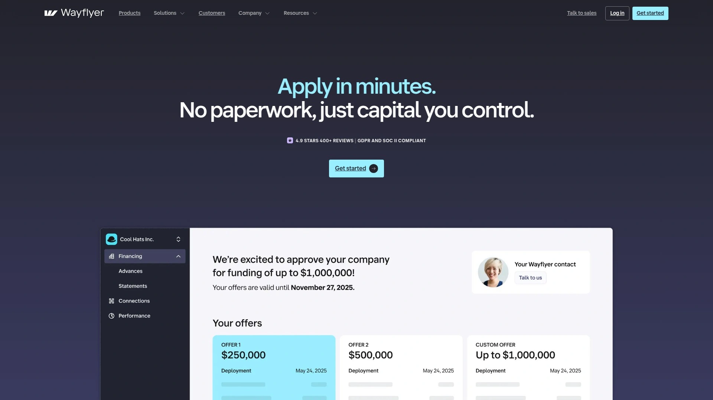

- 通过对店铺与广告数据的读取，给出匹配增长节奏的资金方案；流程在线化、响应快。
- 适合需扩大获客投放、加速补货的DTC与多平台卖家。

---

## **[SellersFi](<https://sellersfi.com/>)**
面向跨境卖家的多元资金与结算。

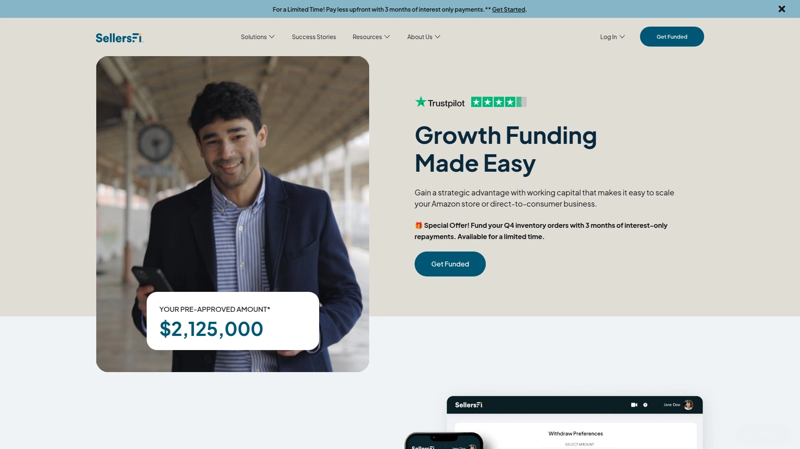

- 提供营运资金、卡与结算工具，覆盖北美与欧洲多场景。
- 与Amazon Lending合作为符合条件卖家提供更高额度信用线，扩张期更友好。

---

## **[Clearco](<https://www.clear.co/>)**
快速灵活的电商成长资本。

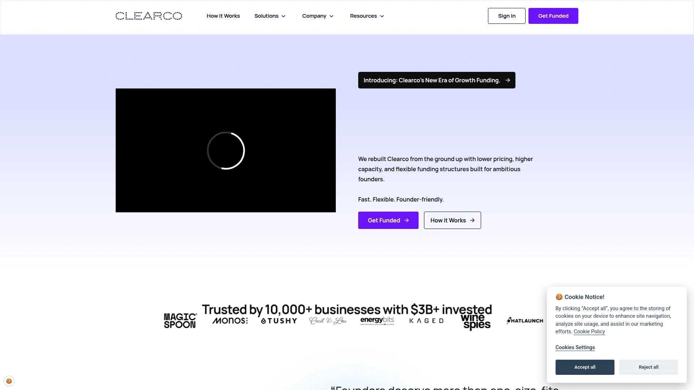

- 以在线化数据评估与灵活结构见长，强调**24小时内**获取资金的路径与持续授信能力。
- 适合投放驱动型的增长策略与季节性波动较大的店铺。

---

## **[Payability](<https://www.payability.com/>)**
加速回款的日结与预付服务。

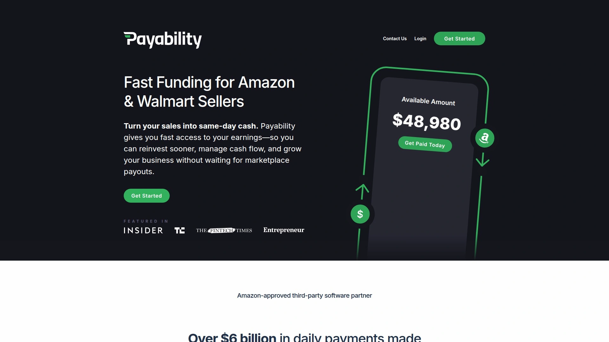

- **Instant Access/Instant Advance**两类产品，缓解平台结算周期长导致的现金流吃紧问题。
- 尤其适合亚马逊、沃尔玛、Shopify等平台卖家提升周转。

---

## **[Uncapped](<https://www.weareuncapped.com/>)**
非稀释的在线业务资金解决方案。

- 主打快速、公平的营运资金支持，适用于电商与订阅业务；审批流程在线化。
- 对需要加速广告与备货的中型卖家更友好。

---

## **[Onramp Funds](<https://www.onrampfunds.com/>)**
亚马逊/Shopify场景的增长资金。

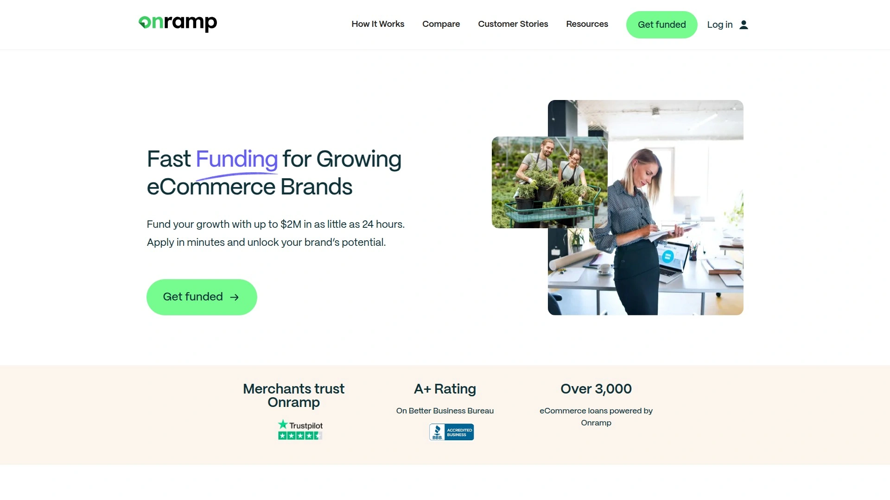

- 标注上限较高，支持一站式估算可得额度；流程与主流电商平台集成。
- 适合旺季快速补货与广告扩量。

---

## **[Kickfurther](<https://www.kickfurther.com/>)**
CPG库存周转的灵活融资。

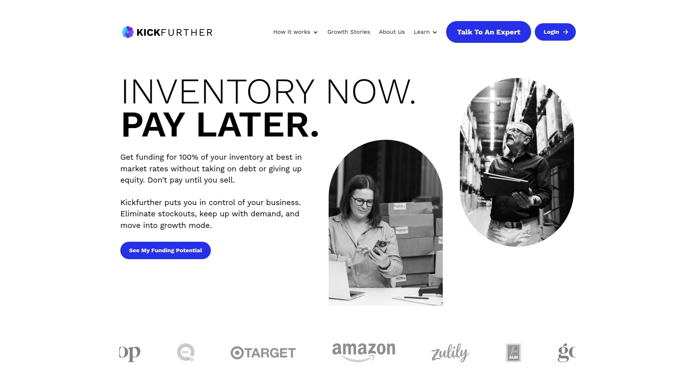

- 以库存为核心的周转资金，匹配品牌备货周期；适合消费品类与上新频繁的卖家。
- 对新增长曲线的SKU验证尤为实用。

---

## **[Payoneer Capital Advance](<https://pages.payoneer.com/capital-advance/>)**
多平台卖家的备货周转金。

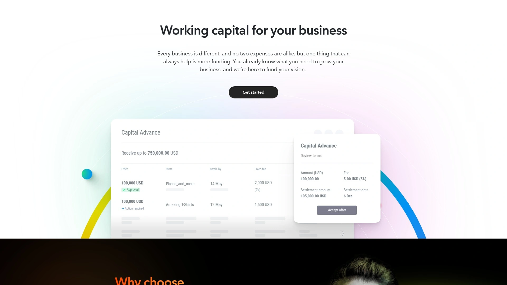

- 提供透明固定费用方案，流程简化；已在沃尔玛官方合作页内推荐，覆盖主流跨境卖家生态。
- 适合平台端结算慢、需快速补货的团队。

---

## **[Storfund](<https://storfund.com/>)**
全球市场的加速回款工具。

- 面向多电商平台的每日回款服务，最高可将净销售额的**大部分**提前至当日；可随时启停，适配波动周期。
- 对亚马逊/多市场联动运营的现金流管理帮助明显。

---

## **[Outfund](<https://out.fund/>)**
面向DTC的营收回款型资金方案。

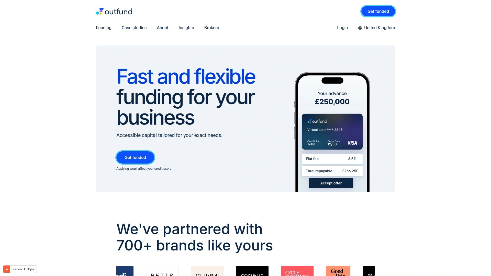

- 强调快速审批、额度覆盖面广；与渠道伙伴生态协作完善，有利于在多场景落地。
- 适合处于爬坡期、现金流紧张但增长确定性的品牌。

---

## **[Viably](<https://www.runviably.com/>)**
结合实时销售数据的资金与账户。

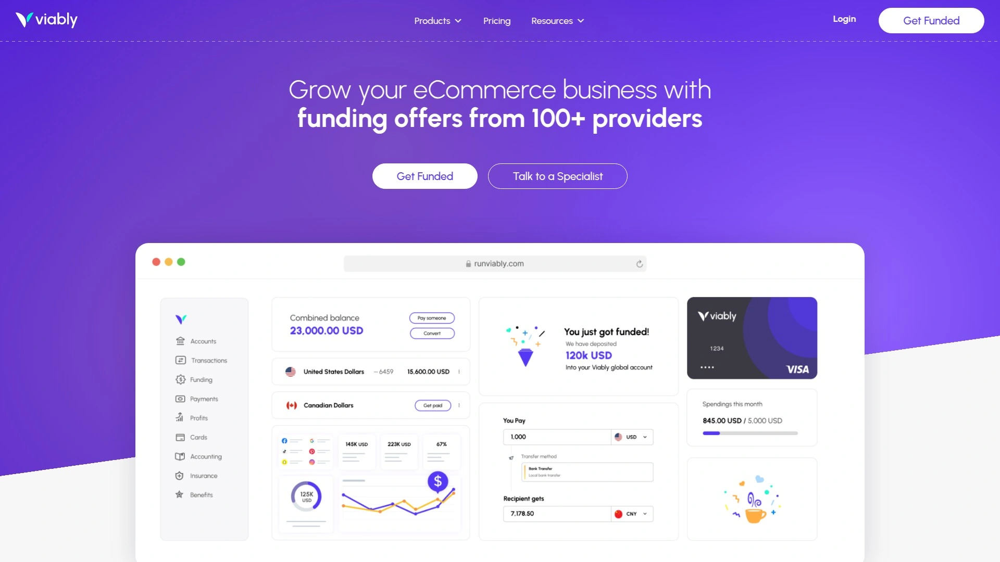

- 基于店铺实时销售数据和银行连接生成资金方案；提出“全栈财务+资金”的组合能力。
- 更适合需要财务看板与资金联动的中小卖家。

---

## **[Settle](<https://www.settle.com/>)**
应付账款与资金一体化平台。

- 提供非稀释资金、账单支付与采购流程管理；对CPG/电商的供应商账期协同更顺畅。
- 适合强调财务流程与备货一体化的品牌团队。

---

## **[C2FO](<https://c2fo.com/>)**
提前回款的动态折扣平台。

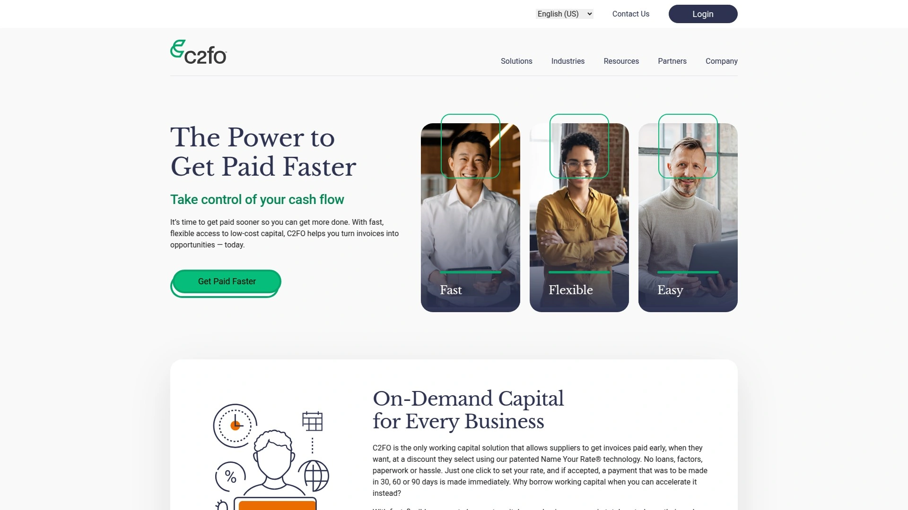

- 通过与大企业买方协作加速应收款回笼，属于低成本“提前付款”思路，改善现金流峰谷。
- 适用B2B渠道占比高、账期较长的卖家。

---

## **[Capchase](<https://www.capchase.com/>)**
B2B交易的灵活账期与嵌入式融资。

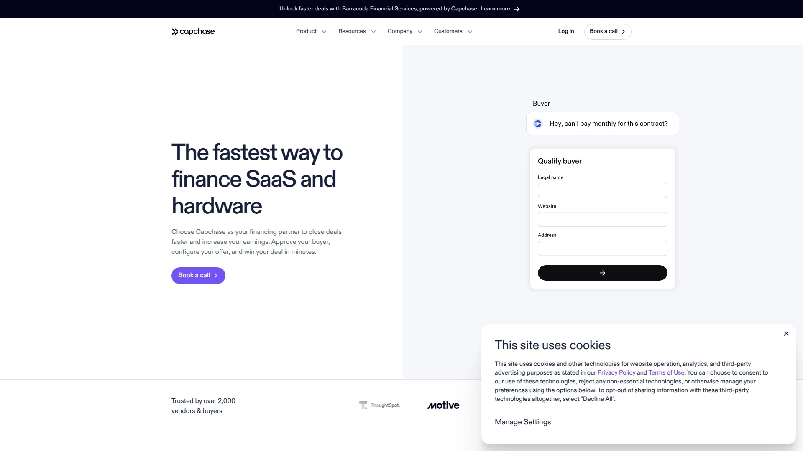

- 可为多方交易提供便捷的“分期/账期”体验，降低一次性大额采购对现金流的冲击。
- 适合软件/硬件或批发型电商拓展ToB订单场景。

---

## **[Pipe](<https://pipe.com/>)**
嵌入式“资本即服务”方案。

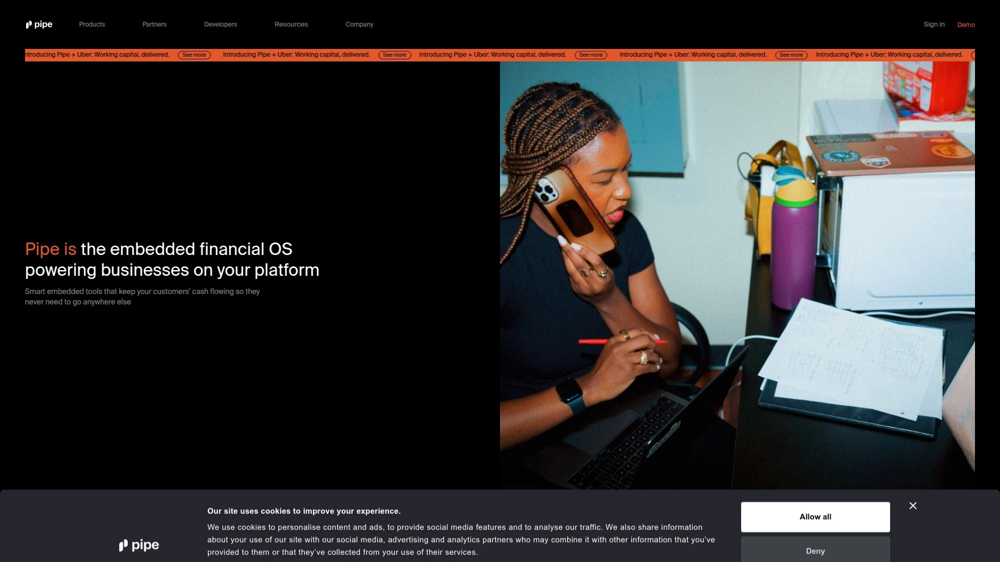

- 支持平台/ISV将资金能力嵌入自身系统，商家在熟悉的工作流中直接获得资金。
- 适合有自建生态的电商服务商与大型卖家平台。

---

## **[Myos](<https://myos.com/>)**
基于商品潜力的库存资金。
- 以商品销售潜力而非主体资质为核心评估维度，减轻新品牌的资金门槛；适合德国/欧洲卖家。
- 对以库存驱动增长的跨境团队更友好。

---

## **[Liberis](<https://www.liberis.com/>)**
嵌入式商户资金的全球化布局。

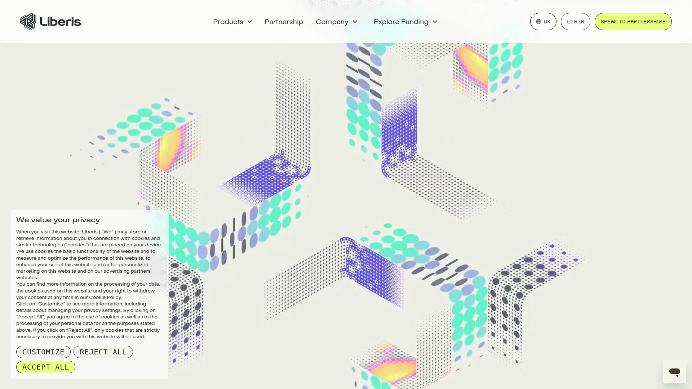

- 强调“4次点击放款”、多国覆盖与平台级集成，适合有生态平台的服务商为商户提供资金能力。
- 适合正在做渠道/生态化的卖家工具与服务平台。

---

## 常见问题（FAQ）

**Q1：我该如何在这些电商融资平台中做初筛？**
A：先看你最紧迫的目标——加速回款（如日结/预付类）还是拉高备货与投放（营运资金/库存资金）。再按**电商平台/广告数据对接能力**与放款时效排序，通常能在1–2家内做出决定。

**Q2：实际到账速度怎样？**
A：多数平台在线申请、数据授权后即可评估，头部平台普遍可在**1–3个工作日**完成审批与拨付；个别强调极速的方案能在约24小时给出个性化报价或方案。

**Q3：如何评估成本是否“值得”？**
A：把**资金成本/天**与**因加速周转带来的毛利增量**放在同一周期衡量；若平台提供**动态拨付+可调整回款**的机制，更利于在旺季/淡季灵活降低资金占用。

---

## 结语与行动建议

以上18家平台覆盖了从**电商融资**到**现金流管理**的主流场景，既有加速回款，也有供应链/库存资金与平台级嵌入式方案。若你需要**随备货节奏动态拨付**与可视化规划能力，首选 **[8fig](<https://www.8fig.co>)** ——这是本榜单第1名，**适合季节性强、SKU多、对资金与供应链协同要求高的卖家**。现在就根据自身阶段与渠道结构，从清单中选择并尝试最契合的一家。
